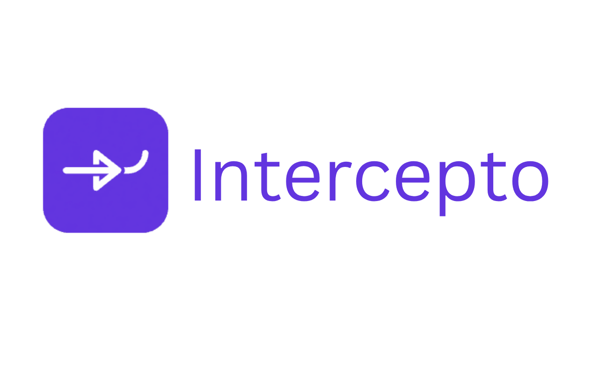

  <a href="https://abolkog.github.io/intercepto/index.html" target="_blank" rel="noreferrer noopener">
    <picture>
      
    </picture>
  </a>

Intercepto is a Chrome extension for mocking API calls in the browser.
It matches requests by URL and HTTP method, then returns custom status codes
and response bodies directly from extension rules.

  <a href="https://chromewebstore.google.com/detail/intercepto/mdgonajbjgpgemlcocmkdjegoplalbfo"><strong>Get The Extension</strong></a> ·
  <a href="https://github.com/abolkog/intercepto/issues/new/choose"><strong>Report a bug</strong></a> ·

## Features

| Feature                | What it does                                                   |
| ---------------------- | -------------------------------------------------------------- |
| 🎯 Rule-Based Matching | Match requests by URL pattern and HTTP method                  |
| 🧾 Custom Responses    | Return custom status codes with JSON or text bodies            |
| 🌐 Fetch & XHR Support | Works with page requests made through fetch and XMLHttpRequest |
| 🖥️ Popup & Options UI  | Manage all your rules from a simple, dedicated UI              |
| 💾 Local Storage       | Everything is stored locally — nothing leaves your browser     |
| 📖 Open Source         | Free to use, inspect, and contribute to                        |

## Why developers pick Intercepto

- 🔒 **Everything Stays Local:** No accounts, no cloud sync. Your rules live in your browser, under your control.
- ⚡ **Lightweight & Fast:** No servers to run, no proxies to configure. Just create a rule and go.
- 🆓 **Free & Open Source:** No tiers, no limits, no paywalls. Ever.

> "Mock any API response without touching a line of backend code."

Rule-based API mocking, right in your browser. **No backend changes required.**

## Contributing

Want to run Intercepto locally, submit a PR, or understand the release process?
See [CONTRIBUTING.md](CONTRIBUTING.md).

## License

This project is licensed under the MIT License. See the [LICENSE](LICENSE) file for details.
